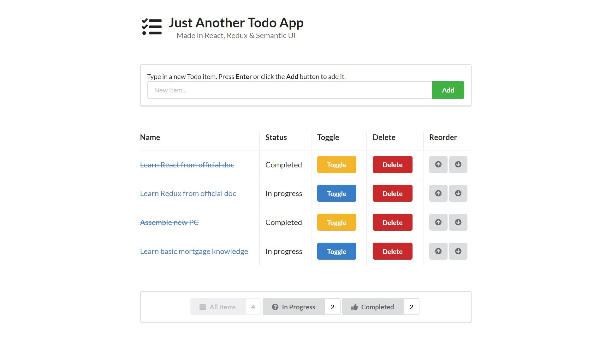

# Just Another Todo App
Just another todo app, made in React and Redux. 

**View it live on [Heroku](https://rocky-bastion-19004.herokuapp.com/)!**




## Build & Deploy
You can also clone this repo and run it locally on your own machine. This application is scaffolded using [create-react-app](https://github.com/facebook/create-react-app), so the process is the standard one:

1. Make sure you have [Node.js](https://nodejs.org/en/) and [Git](https://git-scm.com/downloads) installed.
1. Clone the repo: `git clone https://github.com/charliegdev/just-another-todo-app.git`
1. Go into the repo: `cd just-another-todo-app`
1. Install dependencies: `npm i`
1. Start the dev server: `npm start`
1. Start the tests: `npm test`

## On Top of the Tutorial
This repo follows the steps in this [Redux official tutorial](https://redux.js.org/basics/usagewithreact); however, many things are done on top of the tutorial sample, such as:

1. Implemented several new functionalities:
    * Delete a todo
    * Reorder the list
    * Display the total amount of todos under a category in filter buttons
1. Utilized `react-redux` to avoid *ghost props*: props which are received by a parent, then passed down to its descendents (possibly for a couple layers) without using them in the parent at all. This is an issue with React local state, so I created `ActionableTodo` container component and hooked it up with `react-redux` to solve this problem. No more ghost props.
    * Old:
    ```jsx
    // Too many ghost props!
    const TodoList = ({ todos, onTodoClick, onTodoDelete, onTodoMoveUp, onTodoMoveDown }) => (
      // ...
      // None of the functions are used in <TodoList />; those props are simply passed to <Todo />
      {todos.map(todo => <Todo 
        key={todo.uuid} 
        {...todo} 
        onTodoClick={onTodoClick} 
        onTodoDelete={onTodoDelete}
        onTodoMoveUp={onTodoMoveUp}
        onTodoMoveDown={onTodoMoveDown}
      />)}
      // ...
    );
    ```
    * New:
    ```jsx
    // No longer receives those functions as props 
    const TodoList = ({ todos }) => (
      // ...
      // No longer passes them.
      // <ActionableTodo /> will pass those to <Todo /> with the help of <Provider></Provider>
      {todos.map(todo => <ActionableTodo key={todo.uuid} {...todo} />)}
      // ...
    );

    ```

1. All presentational components come with a rendering test and a snapshot test.
1. The UI is designed and implemented with Semantic UI, so it looks more completed than a bare minimal tutorial sample.


## Wishlist
During the development process, I eventually came up with a wishlist that I hope one day I can either solve it myself, or find a solution provided by the community. I didn't have time to research them myself this time, and maybe these will be the mysteries I'll attempt to solve after completing this project.

### ESLint with Plugins
It's weird that `create-react-app` doesn't come with ESLint configurations. I guess it's because `create-react-app` claims to be a "configuration-free" scaffolding tool, so it can't be opinionated, and things like linters can be highly opinionated and controversial. 

In the future, I hope to find a way of integrating my `.eslintrc` file inside a scaffolding tool, and add these 2 plugins into my `package.json`:

* `eslint-plugin-jest`
* `eslint-plugin-react`

This way, I don't have to change my `package.json` and copy `.eslintrc` from my other projects.

### Hot Module Replacement
Hot Module Replacement: when a component's code changes, HMR allows the browser to re-render that component only, without refreshing the whole page thus losing application state. 

Plain React allows the usage of HMR implicitly, and it's very joyful to use. Now with Redux 2.0 or newer, I have to use it explicitly. The migration guide is [here](https://github.com/reduxjs/react-redux/releases/tag/v2.0.0), but I haven't got time to look at how to use it. I'll definitely get it working in the future.

### Semantic UI React
I have used Semantic UI in several of my past projects; however, this is my first time trying the teams' official React integration, [**Semantic UI for React**](https://react.semantic-ui.com/).

This means instead of writing HTML/JSX the old way, like this:
```html
<div class="ui menu">
  <a class="item" href="/home">
    Home
  </a>
</div>
```

I can write it like this:
```jsx
import { Link } from "react-router-dom";
import { Menu } from "semantic-ui-react";

<Menu>
  <Menu.Item as={Link} to='/home'>
    Home
  </Menu.Item>
</Menu>
```

I fell in love with the new way at once, and started trying it in this project. Unfortunately, Semantic UI React causes Jest tests to slow down from 200ms to 10s. Googling reveals no solutions yet, and it seems neither the Semantic team nor the Jest team want to step in to fix it. Therefore, I had to remove it and revert to the old way. I'm not sure if there will be a solution in the future.

## Final Thoughts
It seems "Todo App" is the "Hello World" for learning frameworks and libraries. Since it involves changing application states, it's a good project to learn:

1. How to use Redux to manage a JavaScript application's states
1. How to integrate Redux with React using `react-redux` and the [presentational & container components](https://medium.com/@dan_abramov/smart-and-dumb-components-7ca2f9a7c7d0) design pattern
1. What Redux solves, and how to take advantage of it over React local state.

That being said, for an application this scale, React local state is more than capable of handling the states. Using Redux here is purely for educational purpose. The more functionalities we pile onto this simple application, the more beneficial Redux is; however, for now, local state is totally fine.